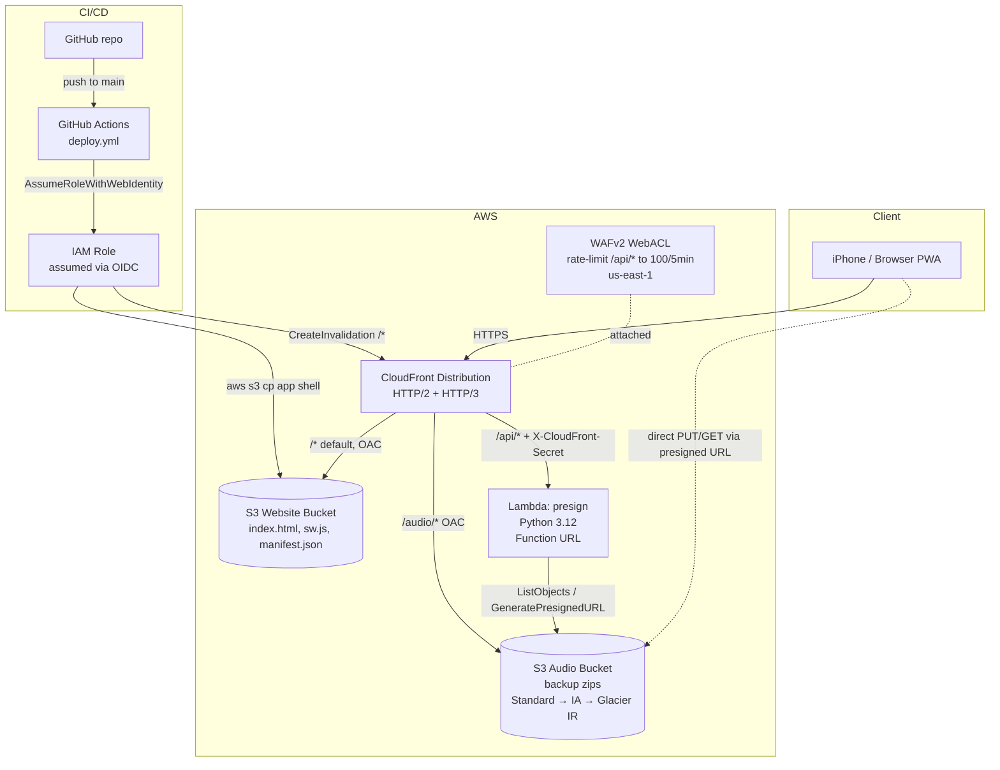

# KML Chargers – Walk-Up Songs

A mobile-first Progressive Web App (PWA) for managing and playing baseball walk-up song sequences. Built for the KML Chargers, it lets a coach or scorekeeper assign two-part audio clips to each player — an announcer intro followed by a walk-up song — and play them with a single tap.

The app runs entirely client-side in the browser. It's hosted on AWS (S3 + CloudFront + Lambda) with an optional cloud-backup feature that syncs the roster to a private S3 bucket via presigned URLs.

---

## Features

- **Roster management** — Add, edit, and remove players with jersey number and name
- **Two-part audio per player** — An announcer intro clip (plays in full) followed by a music clip
- **Music start timestamp** — Set the exact point in the song to start from (e.g. `1:23`)
- **Configurable music duration** — Default 7 seconds per player, adjustable 1–60 s
- **Stadium audio FX** — Convolution reverb + delay line applied to every clip; low/high-shelf filters deepen the announcer's voice
- **Fade-out** — Music fades smoothly over the final 2 seconds of the clip
- **Drag-to-reorder** — Long-press and drag the ⠿ handle to reorder the roster
- **Now Playing bar** — Fixed bottom bar shows the current player name, phase, and a progress bar
- **Cloud backup** — Save named backups to S3 and restore them on any device
- **Offline support** — Works fully offline once loaded (Service Worker + IndexedDB)
- **PWA installable** — Can be saved to the iPhone home screen for a full-screen native-like experience

---

## How It Works

### Data Storage
All roster and audio data is stored locally in the browser; a copy can be pushed to S3 on demand.

- **Player metadata** (name, number, audio file names, start timestamp, order) is stored in **IndexedDB** (`walkup_db`, `players` store)
- **Audio blobs** are stored in **IndexedDB** (`walkup_db`, `audio_blobs` store), keyed by `{playerId}_{type}_{timestamp}`
- **Config** (music duration) is stored in `localStorage` under `walkup_config`
- **App shell** (`index.html`, `sw.js`, `manifest.json`) is cached by the **Service Worker** for offline use. The cache name is stamped with the UTC deploy timestamp (e.g. `walkup-20260430T213000Z`) so browsers pick up updates on the next visit.

### Playback Flow
1. Tap the green ▶ button on a player card
2. The announcer intro plays in full with a deeper-voice EQ (low-shelf +5 dB at 200 Hz, high-shelf −5 dB at 3500 Hz) and +1.5× gain boost
3. The music clip starts at the saved timestamp and plays for the configured duration (default 7 s), fading out over the final 2 s
4. Playback ends automatically — or tap ■ Stop at any time

Every clip is routed through a shared **Web Audio** graph:

```
Audio element → MediaElementSource → [optional shelf EQ] → GainNode
                                                           │
                              ┌────────────────────────────┤
                              ▼                            ▼
                        dry (0.75)                  convolver reverb (0.20)
                              │                            │
                              │                            ▼
                              │                       delay 380 ms, feedback 0.15 (0.125)
                              └─────────────┬──────────────┘
                                            ▼
                                       destination
```

The gain node is also what schedules the 2-second linear fade-out. Using a `GainNode` rather than `audio.volume` is required because iOS Safari ignores direct `volume` assignments.

### Cloud Backup
The **☁ Cloud Backup** card in the Manage panel provides Save/Load against a private S3 bucket.

- **Save Backup** — Zips `players.json` + every audio blob (via JSZip), requests a presigned PUT URL from the presign Lambda (`GET /api/presign/upload?filename=<name>.zip`), and uploads the zip directly to S3 from the browser. Upload URLs expire after 5 minutes.
- **Load Backup** — Lists existing backups (`GET /api/presign/list`), fetches a presigned GET URL (`GET /api/presign/download?filename=<name>.zip`, 30-minute TTL), downloads the zip directly from S3, wipes the local IndexedDB, and restores the roster.

The browser never talks to the Lambda or S3 directly — every request goes through CloudFront. The Lambda rejects anything that doesn't carry the `X-CloudFront-Secret` header that CloudFront injects on its behalf.

---

## Architecture



**Key design choices**

- **OAC everywhere** — Both S3 buckets block all public access and are reachable only via CloudFront using Origin Access Control signed with SigV4.
- **Shared-secret Lambda auth** — The presign Lambda's Function URL is `AuthType: NONE`, but CloudFront injects a secret header (`X-CloudFront-Secret`) on every request. The Lambda returns `403` for anything without it, which closes the "anyone-with-the-URL can call it" hole.
- **Whole stack deploys to us-east-1** — CloudFront only accepts WAFv2 ACLs scoped to `CLOUDFRONT`, which are always in us-east-1. The WebACL lives in the same stack as the distribution, so the whole stack targets that region. CloudFront itself is global.
- **Lifecycle tiering for audio bucket** — Backups transition to Standard-IA at 30 days and Glacier Instant Retrieval at 90 days to keep storage costs low while preserving millisecond retrieval.
- **SPA fallback** — CloudFront rewrites 403 and 404 responses to `/index.html` with a 200, so deep links and S3 access-denied responses still load the app.

---

## File Structure

```
index.html                    — Entire application (HTML + CSS + JS, single file)
sw.js                         — Service Worker (offline caching + cache-version stamping)
manifest.json                 — PWA web app manifest

iac/
  main.yaml                   — WAFv2 WebACL, S3 buckets, CloudFront, presign Lambda, OAC (us-east-1)
  ghrole.yaml                 — GitHub Actions OIDC role (deploy LAST)

lambda/
  presign/index.py            — Presigned-URL Lambda source (inlined into main.yaml,
                                this file is the readable copy)

.github/workflows/
  deploy.yml                  — Auto-deploys app shell to S3 + invalidates CloudFront
```

No build system, no npm, no dependencies to install for the app itself. Everything runs directly in the browser.

### External CDN Dependencies (loaded at runtime)
- **JSZip 3.10.1** — `https://unpkg.com/jszip@3.10.1/dist/jszip.min.js`
- **SortableJS 1.15.2** — `https://cdn.jsdelivr.net/npm/sortablejs@1.15.2/Sortable.min.js`

---

## Deploying to AWS

Deploy the two CloudFormation stacks in order, then perform two manual console steps. All commands assume the AWS CLI is configured with an admin-level profile. **Both stacks must be deployed to `us-east-1`** — CloudFront-scoped WAFv2 ACLs only exist there, and the stack co-locates the WebACL with the distribution.

### 1. Main stack (us-east-1)

Generate a random secret that CloudFront and the Lambda will share:

```bash
SECRET=$(python3 -c "import uuid; print(uuid.uuid4())")
```

```bash
aws cloudformation deploy \
  --stack-name walk-up-songs-main \
  --template-file iac/main.yaml \
  --region us-east-1 \
  --capabilities CAPABILITY_NAMED_IAM \
  --parameter-overrides \
      CloudFrontSecret=$SECRET
```

Copy the `WebsiteBucketName`, `CloudFrontDistributionId`, and `CloudFrontURL` outputs.

### 2. Manual console steps (post-deploy)

Two console actions cannot be expressed in CloudFormation and must be done by hand after the main stack finishes deploying:

**a. Switch the CloudFront distribution to the Free flat-rate pricing plan.**

1. Open the CloudFront console → **Distributions** → select the `walk-up-songs` distribution.
2. Open the **Pricing plans** (or **Change pricing plan**) action.
3. Choose **Free** → confirm.

This swaps the per-WebACL/per-rule billing (~$6/month) for the bundled Free-tier allotment (100 GB transfer, 1 M requests, up to 5 WAF rules — well above this app's footprint).

**b. Re-save the Lambda Function URL policy.**

There is an AWS bug where the `AWS::Lambda::Permission` declared by the stack reports success but the resource-based policy statement is not actually attached to the function. Symptom: requests to `/api/presign/*` return 403 from CloudFront. Fix:

1. Open the Lambda console → functions → `walk-up-songs-presign`.
2. Go to the **Configuration** tab → **Function URL**.
3. Click **Edit**.
4. Review the policy (no changes needed) and click **Save**.

This one console save causes Lambda to correctly attach the `lambda:InvokeFunctionUrl` statement with `Principal: *` to the function's policy. Only required once per stack creation — subsequent `aws cloudformation deploy` runs do not undo it.

### 3. GitHub Actions role

```bash
aws cloudformation deploy \
  --stack-name walk-up-songs-ghrole \
  --template-file iac/ghrole.yaml \
  --region us-east-1 \
  --capabilities CAPABILITY_NAMED_IAM \
  --parameter-overrides \
      GitHubOrg=<your-github-org-or-username> \
      GitHubRepo=walk-up-songs \
      WebsiteBucketName=<from step 1> \
      CloudFrontDistributionId=<from step 1>
```

### 4. Wire up GitHub Actions

In **Settings → Secrets and variables → Actions**, add:

| Secret | Value |
|---|---|
| `AWS_ROLE_ARN` | `RoleArn` output from step 3 |
| `S3_BUCKET_NAME` | `WebsiteBucketName` from step 1 |
| `CLOUDFRONT_DISTRIBUTION_ID` | `CloudFrontDistributionId` from step 1 |

Any push to `main` that touches `index.html`, `sw.js`, or `manifest.json` will:

1. Stamp `sw.js` with a `walkup-<UTC-timestamp>` cache name (forces clients to pick up the new build)
2. Upload the three files to S3 with appropriate `Cache-Control` headers
3. Issue a CloudFront invalidation for `/*`

The app is then live at the `CloudFrontURL`.

---

## Saving to iPhone Home Screen (PWA Install)

1. Open the app URL in **Safari** on iPhone (must be Safari — Chrome/Firefox on iOS cannot install PWAs)
2. Tap the **Share** button (the box with an arrow pointing up) in the Safari toolbar
3. Scroll down and tap **"Add to Home Screen"**
4. Edit the name if desired, then tap **Add**

The app will appear on your home screen with a full-screen launch experience (no browser chrome). It will work offline after the first load.

> **Note:** Each browser/device has its own isolated IndexedDB. Data saved in Safari on your iPhone is separate from data in Chrome on your PC. Use **Cloud Backup** to move a roster between devices.

---

## Usage Tips

### Adding Players
Tap **⚙ Manage Roster** in the header to reveal the Add Player form, Music Duration setting, and Cloud Backup card. This panel is hidden by default to keep the play screen clean during a game.

### Setting a Music Start Time
Once a music file is attached to a player, a **⏱ Start** row appears below it. Enter the timestamp in `m:ss` format (e.g. `1:23`) where you want the clip to begin. The app will play from that point for the configured duration and fade over the final 2 seconds.

### Changing the Music Duration
The **Music Duration** setting in the Manage panel controls how long each walk-up clip runs (1–60 seconds, default 7). The last 2 seconds are always a linear fade, so values below 3 will be almost entirely fade.

### Reordering the Roster
Grab the **⠿** handle on the left side of any player card and drag it to reorder. Order is persisted automatically.

### Backing Up Data
Use **☁ Cloud Backup → Save** to push a named backup to S3. Tap **↺** in the Load row to refresh the list of existing backups, pick one, and tap **Load** to restore. Loading a backup replaces all local roster data.

---

## Managing Backups in S3

The audio bucket has **versioning enabled**, so saving a backup under an existing name doesn't destroy the old one — the previous copy becomes a noncurrent version. Noncurrent versions tier to Glacier Instant Retrieval after 30 days but are never auto-expired; they persist for as long as the current version does.

The app UI only reads the current version of each key. Recovering or permanently deleting a backup is a manual operation against S3.

### Restore a prior version from the console

1. Open the audio bucket in the S3 console (name: `<account-id>-walk-up-songs-audio`).
2. Toggle **Show versions** on in the object list.
3. Find the version you want, **Actions → Download**, or copy its `VersionId` and use `aws s3api get-object --version-id …`.

### Permanently delete a backup (all versions)

A regular delete in a versioned bucket just writes a *delete marker* — the old versions still exist and still cost money. To fully wipe a key you must delete every version by `VersionId`.

**Console:**
1. Open the bucket, toggle **Show versions** on.
2. Filter by the key name.
3. Select every row (current version, all noncurrent versions, and any delete markers).
4. **Actions → Delete** → type `permanently delete` to confirm.

**CLI one-liner** (replace `BUCKET` and `KEY`):

```bash
BUCKET=<account-id>-walk-up-songs-audio
KEY=my-backup.zip

aws s3api list-object-versions --bucket "$BUCKET" --prefix "$KEY" \
  --query '{Objects: ((Versions || `[]`) + (DeleteMarkers || `[]`))[?Key==`'"$KEY"'`].{Key:Key,VersionId:VersionId}}' \
  > /tmp/versions.json

aws s3api delete-objects --bucket "$BUCKET" --delete file:///tmp/versions.json
```

> **Heads up:** lifecycle does not automatically purge noncurrent versions when a delete marker appears. If you just run `aws s3 rm s3://…/my-backup.zip`, the old versions remain in storage (billed) until you delete them by `VersionId` as shown above.
